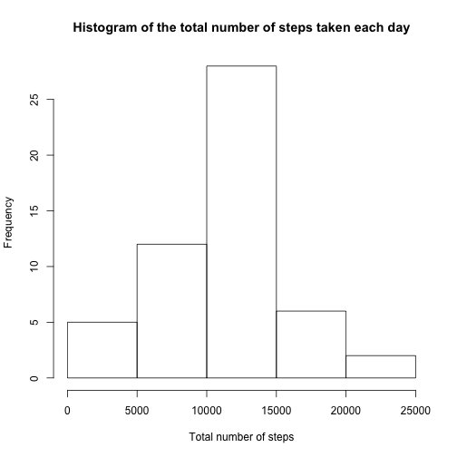
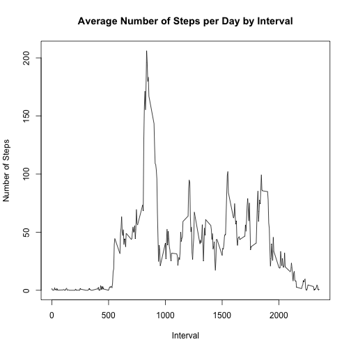
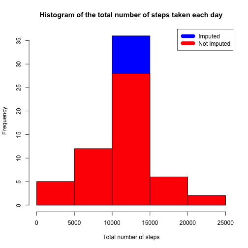
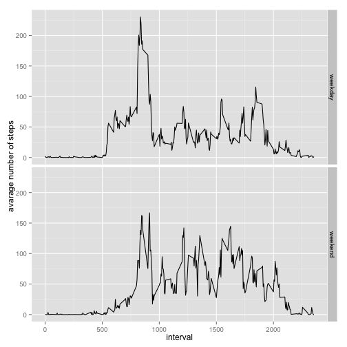

## Loading and preprocessing the data


```r
unzip("activity.zip")
data <- read.csv("activity.csv", na.strings = c("NA"), colClasses = c("numeric", "Date", "numeric"))
```


```r
steps_by_date <- data %>%
  # na.omit() %>%
  group_by(date) %>%
  summarise_each(funs(sum), steps)
```

## What is mean total number of steps taken per day?

1. Histogram of the total number of steps taken each day


```r
hist(steps_by_date$steps, xlab = "Total number of steps",
  main = "Histogram of the total number of steps taken each day")
```

 

2. Mean and median total number of steps taken per day


```r
steps_by_date_mean <- mean(steps_by_date$steps, na.rm = T)
steps_by_date_median <- median(steps_by_date$steps, na.rm = T)
```

* `mean` is **1.0766189 &times; 10<sup>4</sup>**
* `median` is **1.0765 &times; 10<sup>4</sup>**

## What is the average daily activity pattern?

1. Time series plot of the 5-minute interval and the average number of steps taken, averaged across all days


```r
steps_by_interval <- data %>%
  na.omit() %>%
  group_by(interval) %>%
  summarise_each(funs(mean), steps)
```


```r
plot(steps_by_interval$interval, steps_by_interval$steps,
     type="l",
     xlab="Interval", ylab="Number of Steps",
     main="Average Number of Steps per Day by Interval")
```

 

2. Which 5-minute interval, on average across all the days in the dataset, contains the maximum number of steps


```r
max_interval <- steps_by_interval[which.max(steps_by_interval$steps), 1]
```

Interval with maximum number of steps is **835**

## Imputing missing values

1. Total number of missing values in the dataset


```r
incomplete_cases_count <- sum(!complete.cases(data))
```

Total number of missing values in the dataset is **2304**

2. Strategy for filling in all of the missing values in the dataset

Missing values were imputed by inserting the average for each interval.

3.  New dataset that is equal to the original dataset but with the missing data filled in


```r
imputed_data <- data %>% mutate(
  steps = ifelse(is.na(steps),
    steps_by_interval$steps[match(interval, steps_by_interval$interval)],
    steps
  )
)
```

4. Histogram of the total number of steps taken each day and the mean and median total number of steps taken per day.


```r
imputed_steps_by_date <- imputed_data %>%
  group_by(date) %>%
  summarise_each(funs(sum), steps)
```


```r
hist(imputed_steps_by_date$steps, xlab = "Total number of steps", col="blue",
  main = "Histogram of the total number of steps taken each day")
hist(steps_by_date$steps, xlab = "Total number of steps", col="red", add=T,
  main = "Histogram of the total number of steps taken each day")
legend("topright", c("Imputed", "Not imputed"), col=c("blue", "red"), lwd=10)
```

 

Mean and median total number of steps taken per day


```r
imputed_steps_by_date_mean <- mean(imputed_steps_by_date$steps)
imputed_steps_by_date_median <- median(imputed_steps_by_date$steps)
```


```r
mean_diff <- imputed_steps_by_date_mean - steps_by_date_mean
median_diff <- imputed_steps_by_date_median - steps_by_date_median
total_diff <- sum(imputed_steps_by_date$steps) - sum(steps_by_date$steps, na.rm = T)
```

* The difference between the not imputed `mean` and imputed `mean` is **0**
* The difference between the not imputed `median` and imputed `median` is **1.1886792**
* The difference between total number of steps between imputed and not imputed data is **8.6129509 &times; 10<sup>4</sup>**

## Are there differences in activity patterns between weekdays and weekends?

1. New factor variable in the dataset with two levels -- "weekday" and "weekend" indicating whether a given date is a weekday or weekend day


```r
imputed_data <- imputed_data %>% mutate(
  date_type = ifelse(as.POSIXlt(date)$wday %in% c(0, 6),
    'weekend',
    'weekday'
  )
)
```

2. Panel plot containing a time series plot of the 5-minute interval and the average number of steps taken, averaged across all weekday days or weekend days


```r
imputed_steps_by_interval_by_date_type <- imputed_data %>%
    group_by(interval, date_type) %>%
    summarise_each(funs(mean), steps)
```


```r
ggplot(imputed_steps_by_interval_by_date_type, aes(interval, steps)) + 
    geom_line() + 
    facet_grid(date_type ~ .) +
    xlab("interval") + 
    ylab("avarage number of steps")
```

 
